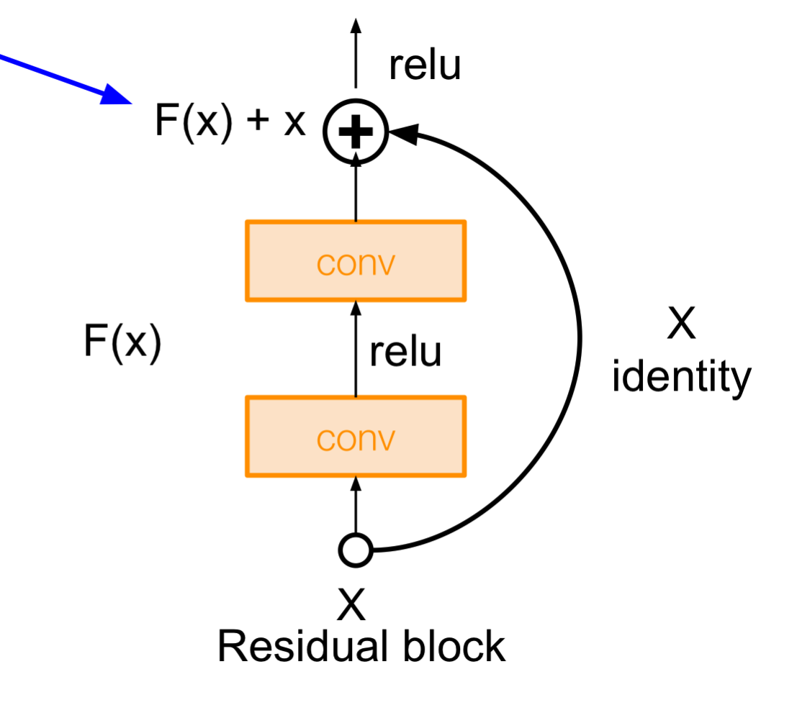

# Lab 2: Convolutional Neural Nets and Synthetic Lines

## Goal of the lab

We're working up to translating images of handwriting to text.
In this lab, we're going to

- Use a simple convolutional network to recognize EMNIST characters.
- Construct a synthetic dataset of EMNIST lines.

## Before you begin, make sure to set up!

Please complete [Lab Setup](/setup/readme.md) before proceeding!

Then, in the `fsdl-text-recognizer-2021-labs` repo, let's pull the latest changes, and enter the correct directory.

```
git pull
cd lab2
```

## Intro to EMNIST

MNIST stands for Mini-NIST, where NIST is the National Institute of Standards and Technology, which compiled a dataset of handwritten digits and letters in the 1980s.

MNIST is Mini because it only included digits.

EMNIST is a repackaging of the original dataset, which also includes letters, but presented in the popularized MNIST format.
You can see a publication about it here https://www.paperswithcode.com/paper/emnist-an-extension-of-mnist-to-handwritten

We can take a look at the data in `notebooks/01-look-at-emnist.ipynb`.

(Note that we now have a new directory in `lab2`: `notebooks`. While we don't do training of our models in notebooks, we use them for exploring the data, and perhaps presenting the results of our model training.)

### Brief aside: data directory structure


You may have noticed that both MNIST and EMNIST download data from the Internet before training.
Where is this data stored?

```
(fsdl-text-recognizer-2021) ➜  lab2 git:(main) ✗ tree -I "lab*|__pycache__" ..
..
├── data
│   ├── downloaded
│   └── raw
│       ├── emnist
│       │   ├── metadata.toml
│       │   └── readme.md
├── environment.yml
├── Makefile
├── readme.md
├── requirements
└── setup
```

We specify the EMNIST dataset with `metadata.toml` and `readme.md` which contain information on how it should be downloaded and its provenance.

## Using a convolutional network for recognizing MNIST

We left off in Lab 1 having trained an MLP model on the MNIST digits dataset.

We can now train a CNN for the same purpose:

```sh
python3 training/run_experiment.py --model_class=CNN --data_class=MNIST --max_epochs=5 --gpus=1
```

## Doing the same for EMNIST

We can do the same on the larger EMNIST dataset:

```sh
python3 training/run_experiment.py --model_class=CNN --data_class=EMNIST --max_epochs=5 --gpus=1
```

Training the single epoch will take about 2 minutes (that's why we only do one epoch in this lab :)).
Leave it running while we go on to the next part.

## Intentional overfitting

It is very useful to be able to subsample the dataset for quick experiments and to make sure that the model is robust enough to represent the data (more on this in the Training & Debugging lecture).

This is possible by passing `--overfit_batches=0.01` (or some other fraction).
You can also provide an int `> 1` instead for a concrete number of batches.
https://pytorch-lightning.readthedocs.io/en/stable/debugging.html#make-model-overfit-on-subset-of-data

```sh
python3 training/run_experiment.py --model_class=CNN --data_class=EMNIST --max_epochs=50 --gpus=1 --overfit_batches=2
```

## Speeding up training

One way we can make sure that our GPU stays consistently highly utilized is to do data pre-processing in separate worker processes, using the `--num_workers=X` flag.

```sh
python3 training/run_experiment.py --model_class=CNN --data_class=EMNIST --max_epochs=5 --gpus=1 --num_workers=4
```

## Making a synthetic dataset of EMNIST Lines

- Synthetic dataset we built for this project
- Sample sentences from Brown corpus
- For each character, sample random EMNIST character and place on a line (optionally, with some random overlap)
- Look at: `notebooks/02-look-at-emnist-lines.ipynb`

## Homework

Edit the `CNN` and `ConvBlock` architecture in `text_recognizers/models/cnn.py` in some ways.

In particular, edit the `ConvBlock` module to be more like a ResNet block, as shown in the following image:



Some other things to try:

- Try adding more of the ResNet secret sauce, such as `BatchNorm`. Take a look at the official ResNet PyTorch implementation for ideas: https://github.com/pytorch/vision/blob/master/torchvision/models/resnet.py
- Remove `MaxPool2D`, perhaps using a strided convolution instead.
- Add some command-line arguments to make trying things a quicker process.
- A good argument to add would be for the number of `ConvBlock`s to run the input through.
