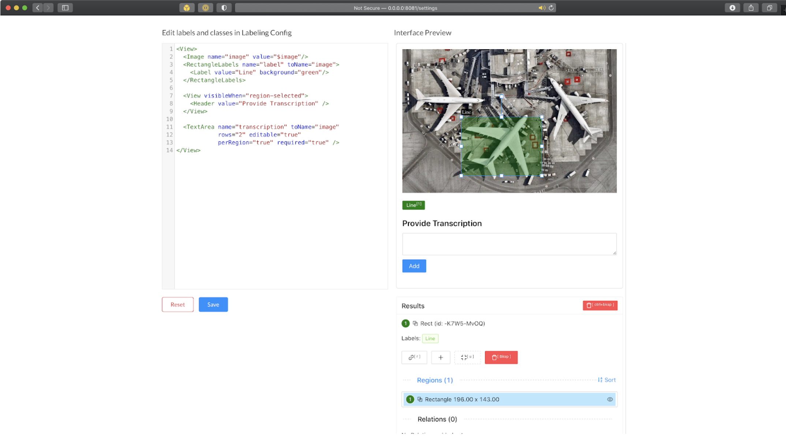

# Lab 6: Data Labeling

In this lab we will annotate some handwriting samples that we collected using the open-source tool Label Studio.

## Collection

Handwritten paragraphs were collected in the FSDL March 2019 class.

The resulting PDF was stored at https://fsdl-public-assets.s3-us-west-2.amazonaws.com/fsdl_handwriting_20190302.pdf

Pages were extracted from the PDF using Ghostscript by running

```sh
gs -q -dBATCH -dNOPAUSE  -sDEVICE=jpeg -r300 -sOutputFile=page-%03d.jpg -f fsdl_handwriting_20190302.pdf
```

and uploaded to S3, with urls like https://fsdl-public-assets.s3-us-west-2.amazonaws.com/fsdl_handwriting_20190302/page-001.jpg

## Annotation

Video recording: https://www.loom.com/share/6c60a353a7fa44d5af75a455f8c3b0c4

We will use the open source tool Label Studio (https://labelstud.io) to do our annotation.

Set up Label Studio on your machine using pip or Docker (recommended):

```sh
docker run --rm -p 8080:8080 -v `pwd`/my_project:/label-studio/my_project --name label-studio heartexlabs/label-studio:latest label-studio start my_project --init
```

After launching it, import a few page images that you downloaded from S3 into Label Studio.

Define the labeling interface to be able to both annotate lines and their text content. This is one possibility, a combination of the “Bbox object detection” and “Transcription per region” templates:



You can also experiment with a polygon (vs rectangle) annotation, or figure something else out!

Then, annotate the few pages you imported. Make sure to annotate each page fully.

When you’re done, you can export the data from the main Tasks page as a JSON file.

## Questions

Think about the decision you made in annotating.

Did you use axis-aligned rectangles, or rotated-as-needed rectangles, or polygon annotations? Why?

Did you transcribe text exactly as you read it, including spelling errors if any, or did you correct the spelling errors? What did you do if you couldn’t quite make some characters out? Why?
