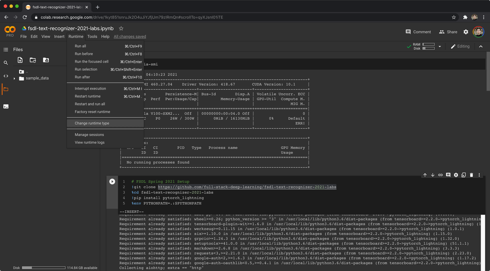
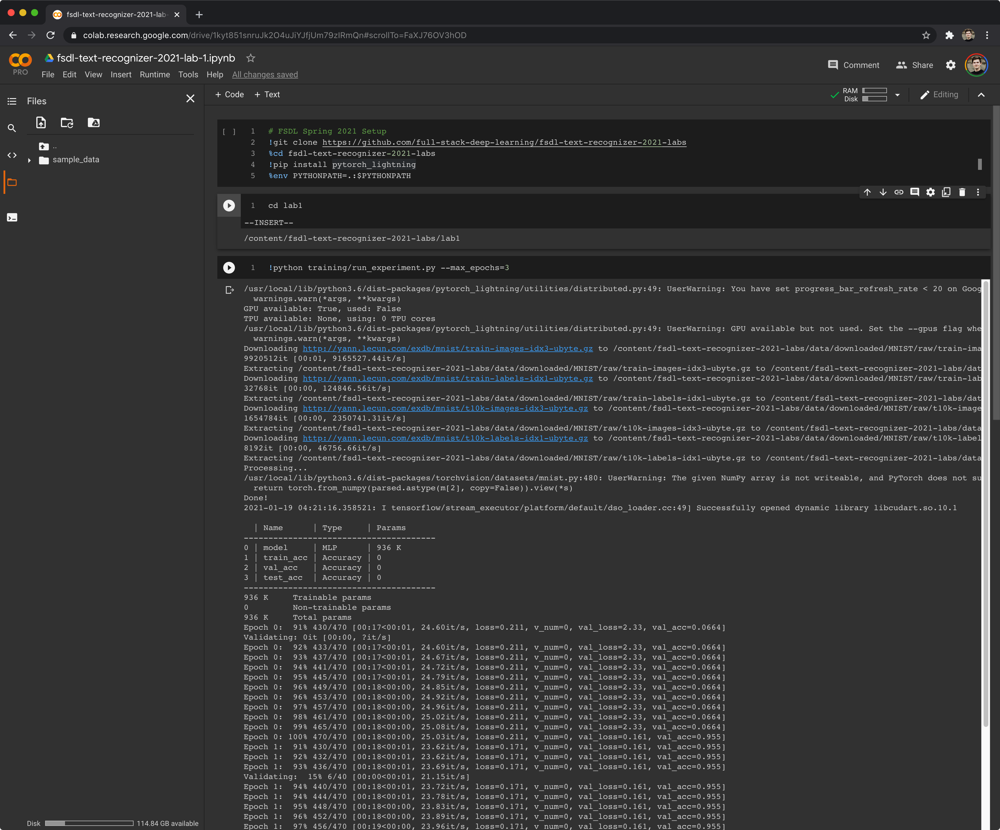
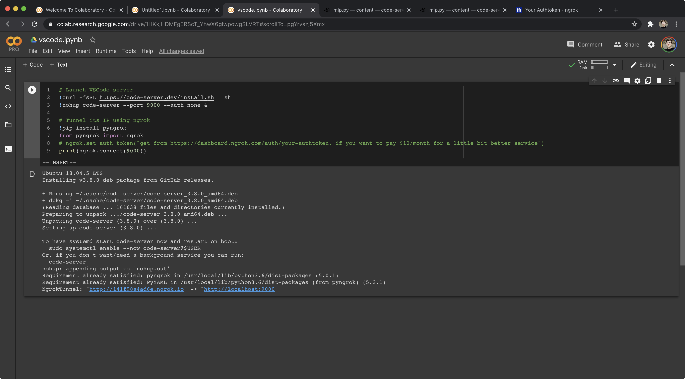
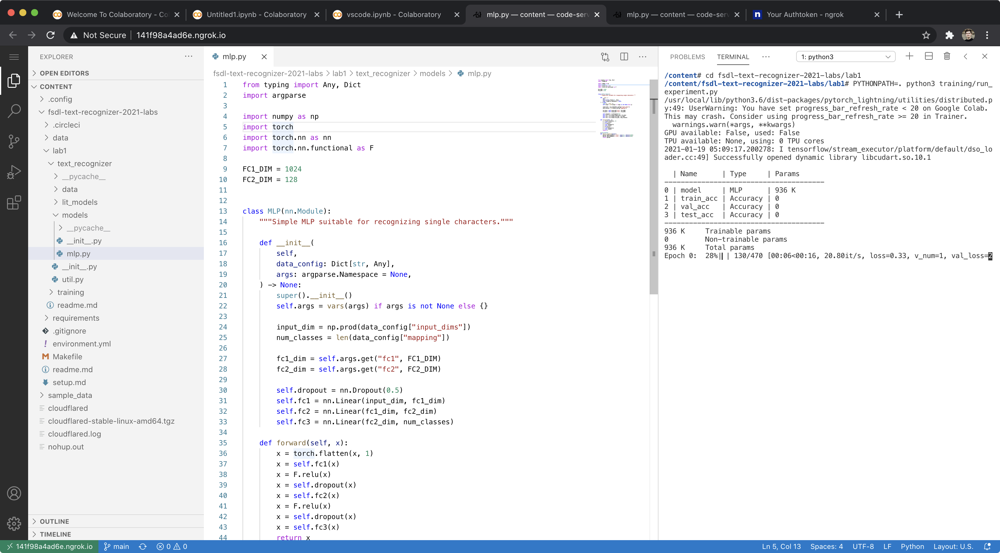

# Setup

Deep learning requires access to accelerated computation hardware.
Specifically, NVIDIA GPUs, or Google TPUs.

If you have access to a computer that has an NVIDIA GPU and runs Linux, you're welcome to [set it up](#Local) for local user.

If you don't, you can compute using [Google Colab](#Colab).

If you'd like to use Google Cloud Platform, we have a [tutorial](https://docs.google.com/document/d/1mSB_p1Chxg6IGYbuRxgPSA3Ps6BjhBZV7Ti3W_Qx0Ws/) for setting up an AI Platform Jupyter Lab instance for computing, which works quite well.

## Colab

**[Watch As Video](https://www.loom.com/share/9c99c49fb9ca456bb0e56ccc098ae87a)**

Google Colab is a great way to get access to fast GPUs for free.
All you need is a Google account (Berkeley accounts will work).

Go to https://colab.research.google.com, and create a New Notebook.

Connect your new notebook to a GPU runtime by doing Runtime > Change Runtime type > GPU.


Now, run `!nvidia-smi` in the first cell (press Shift+Enter to run a cell).
You should see a table showing your precious GPU :)

Now, paste the following into a cell and run it:

```
# FSDL Spring 2021 Setup
!git clone https://github.com/full-stack-deep-learning/fsdl-text-recognizer-2021-labs
%cd fsdl-text-recognizer-2021-labs
!pip3 install boltons wandb pytorch_lightning==1.1.4 pip install torch==1.7.1+cu110 torchvision==0.8.2+cu110 torchaudio==0.7.2 torchtext==0.8.1 -f https://download.pytorch.org/whl/torch_stable.html
%env PYTHONPATH=.:$PYTHONPATH
```

This will check out our lab repository, `cd` into it, install the only missing Python package (`pytorch_lightning` -- everything else, like PyTorch itself, comes pre-installed on Colab), and allows Python to find packages in the current working directory.

Now we can enter the `lab1` directory and make sure things work:


### Colab Pro

You may be interested in signing up for [Colab Pro](https://colab.research.google.com/signup).

For $10/month, you get priority access to fast GPUs (e.g. V100 vs K80) and TPUs, a 24h rather than 12h runtime, and more RAM.

### VSCode on Google Colab

(This is advanced and not necessary -- skip for now!).

It is possible to use the VSCode interface in Colab.

Open a Colab notebook (or continue in the one you may already have going), make sure you're connected to the runtime you want, and run this in a cell:

```
# Launch VSCode server
!curl -fsSL https://code-server.dev/install.sh | sh
!nohup code-server --port 9000 --auth none &

# Tunnel its IP using ngrok
!pip install pyngrok
from pyngrok import ngrok
# ngrok.set_auth_token("get from https://dashboard.ngrok.com/auth/your-authtoken, if you want to pay $10/month for a little bit better service")
url = ngrok.connect(9000)
print(url)
```

This is what you should see:


Clicking the ngrok link takes you to a web VSCode interface:


You can sign up for a paid version of ngrok ($10/month) in order to get `https` tunneling and a slightly nicer experience.

## Local

Setting up a machine you can sit in front of or SSH into is easy.

### 1. Check out the repo

```
git clone https://github.com/full-stack-deep-learning/fsdl-text-recognizer-2021-labs.git
cd fsdl-text-recognizer-2021-labs
```

### 2. Set up the Python environment

We use `conda` for managing Python and CUDA versions, and `pip-tools` for managing Python package dependencies.

We add a `Makefile` for making setup dead-simple.

#### First: Install the Python + CUDA environment using Conda

**Note**: this step is not necessary if you are using the GCP AI Platform Notebooks instance.

Conda is an open-source package management system and environment management system that runs on Windows, macOS, and Linux.

To install `conda`, follow instructions at https://conda.io/projects/conda/en/latest/user-guide/install/linux.html

Note that you will likely need to close and re-open your terminal.
Afterward, you should have ability to run the `conda` command in your terminal.

Run `make conda-update` to create an environment called `fsdl-text-recognizer-2021`, as defined in `environment.yml`.
This environment will provide us with the right Python version as well as the CUDA and CUDNN libraries.

If you edit `environment.yml`, just run `make conda-update` again to get the latest changes.

Next, activate the conda environment.

```sh
conda activate fsdl-text-recognizer-2021
```

**IMPORTANT**: every time you work in this directory, make sure to start your session with `conda activate fsdl-text-recognizer-2021`.

#### Next: install Python packages

Next, install all necessary Python packages by running `make pip-tools`

Using `pip-tools` lets us do three nice things:

1. Separate out dev from production dependencies (`requirements-dev.in` vs `requirements.in`).
2. Have a lockfile of exact versions for all dependencies (the auto-generated `requirements-dev.txt` and `requirements.txt`).
3. Allow us to easily deploy to targets that may not support the `conda` environment.

If you add, remove, or need to update versions of some requirements, edit the `.in` files, and simply run `make pip-tools` again.

#### Set PYTHONPATH

Last, run `export PYTHONPATH=.` before executing any commands later on, or you will get errors like `ModuleNotFoundError: No module named 'text_recognizer'`.

In order to not have to set `PYTHONPATH` in every terminal you open, just add that line as the last line of the `~/.bashrc` file using a text editor of your choice (e.g. `nano ~/.bashrc`)

### Summary

- `environment.yml` specifies python and optionally cuda/cudnn
- `make conda-update` creates/updates the conda env
- `conda activate fsdl-text-recognizer-2021` activates the conda env
- `requirements/prod.in` and `requirements/dev.in` specify python package requirements
- `make pip-tools` resolves and install all Python packages
- add `export PYTHONPATH=.:$PYTHONPATH` to your `~/.bashrc` and `source ~/.bashrc`
